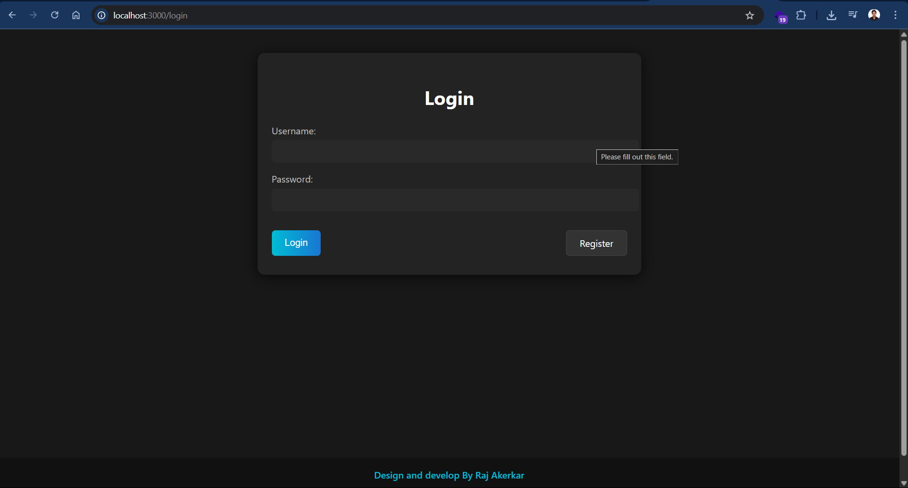
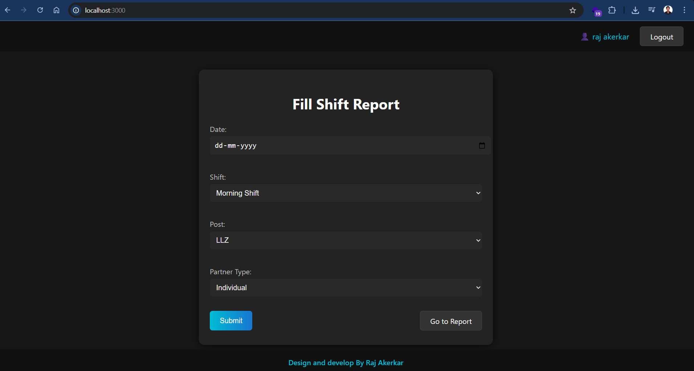
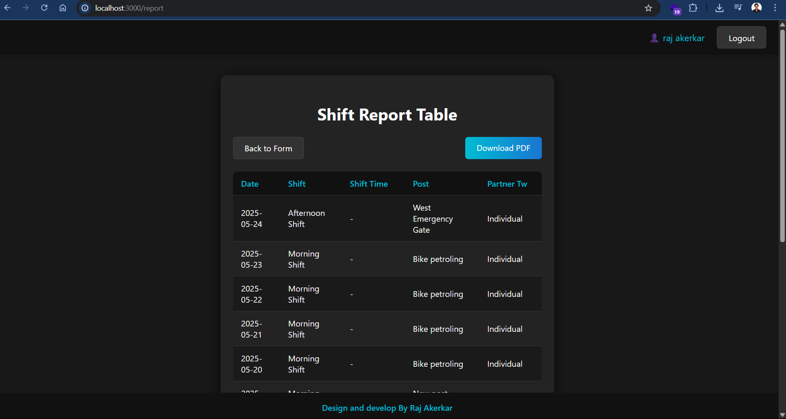

# Duty Report Maker App 📝

A full-stack web application for employees to log and manage duty reports by shifts and posts. Users can securely log in, fill in daily reports, and view their report history with date-wise grouping and PDF download support. Built with Node.js, Express, MongoDB, and EJS templating.

---

## 🧠 Features

- 🔐 Employee Login (No session; stateless authentication)
- 📝 Fill Duty Reports with fields:
  - Date
  - Shift (Morning, Afternoon, Night, or Custom time frame)
  - Post (Predefined list + "Other" option)
  - Partner TW (Individual or Named)
- 📊 View all reports grouped by date
- 📥 Download reports as PDF
- 💾 Persistent storage using MongoDB
- 🖥️ Clean UI using EJS templates

---

## 🛠️ Tech Stack

### Backend
- Node.js
- Express.js
- MongoDB + Mongoose
- EJS (Embedded JavaScript Templates)
- PDFKit (for PDF generation)

### Frontend
- HTML, CSS, JavaScript (served by Express via EJS)

---

## 🚀 Getting Started

### 📦 Prerequisites

- Node.js (v14+ recommended)
- MongoDB (local or cloud)

### 🛠️ Installation

```bash
git clone https://github.com/rajakerkar/Duty-Report-Maker-App.git
cd Duty-Report-Maker-App
npm install
````

### ⚙️ Environment Variables

Create a `.env` file in the root directory:

```
MONGO_URI=your_mongodb_connection_string
PORT=5000
```

### ▶️ Running the App

```bash
npm start
```

Open your browser and visit:

```
http://localhost:5000
```

---

## 📡 API Endpoints

### 🔑 Authentication

| Method | Endpoint | Description    |
| ------ | -------- | -------------- |
| POST   | /login   | Employee login |

### 📝 Reports

| Method | Endpoint            | Description                        |
| ------ | ------------------- | ---------------------------------- |
| POST   | /report/add         | Add new duty report                |
| GET    | /report/all         | Get all reports for logged-in user |
| GET    | /report/downloadpdf | Download entire report as PDF      |

---

## 📸 Screenshots

### 🔐 Login Page



### 📝 Duty Report Form



### 📊 Reports Page



---

## 📄 License

This project is licensed under the [MIT License](./LICENSE).

---

## 📞 Contact

Created by Raj Akerkar. Feel free to open issues or submit pull requests.


